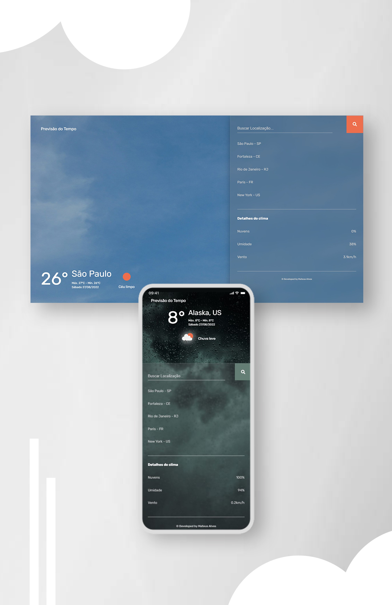

<h1>Weather App - Previsão do Tempo</h1>

<h3>
  Projeto desenvolvido para portifólio pessoal.
</h3>
 

 <!-- <a href="#visao">• Visão geral</a>   -->
 <a href="#leng">• Skills utilizadas</a>
  
 <a href="#contato">• Contato</a>

 

<h1>Visão geral</h1>
É possível saber a previsão do tempo de qualquer cidade do mundo com este <strong>Weather App</strong>, basta pesquisar pela localização desejada no campo de busca, ou clicar em uma das cidades fixadas no <strong>painel</strong>. Dados em tempo real consumidos de uma API que disponibiliza uma série de dados climáticos. No projeto é exibido ao usuário a temperatura atual, a máxima e a mínima. Além de percentual de nuvens no céu, umidade e velocidade do vento, clique no link a seguir para <strong>testar </strong>a aplicação.

 
 

<h1 align="center">
<!-- <h1> -->
<a href="https://matealves.github.io/weatherapp" target="_blank">Testar</a> 
</h1>

  

 

<h1>Skills utilizadas</h1>

 
  
  
      

 
 
 

<h1>Como entro em contato?</h1>

Entre em contato através dos links a seguir!
 
 

 
 
 
